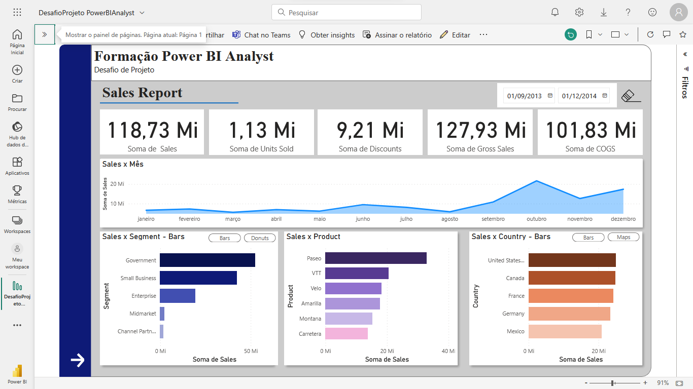
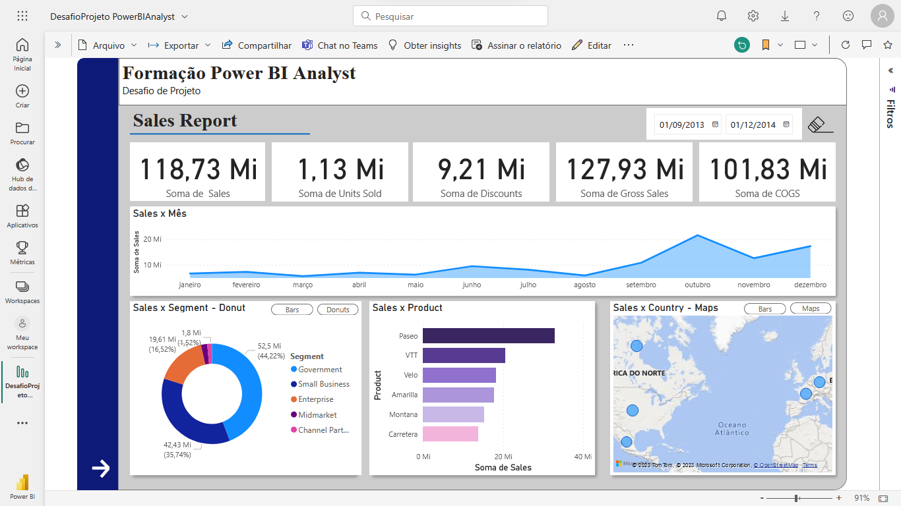
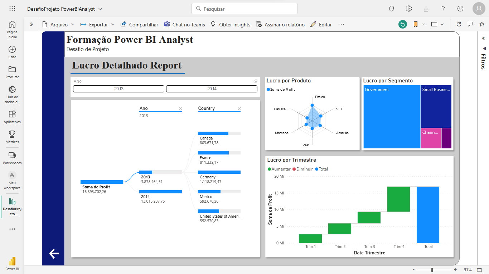

# Desafio de Power BI Analyst

## Proposta
Criar um relatório elaborado com base na sample financials do Power BI.

### Atentar-se a: 

[x] Estrutura definida  
[x] Botões de navegação que fornecem navegabilidade   
[x] Segmentadores utilizados e botões com imagem associado   
[x] Utilize os indicadores e botões para selecionar diferentes visuais sobre um mesmo assunto   

### Utilize os vídeos de passo a passo para criação dos elementos que compõem a primeira página do relatório:

[x] Objetos que definem o layout do relatório   
[x] Gráficos (visuais) e os campos que os compõem   
[x] Botões para navegabilidade   
[x] Segmentadores de dados   

### Lembre-se de:

[x] Criar a segunda página do relatório  
[x] Publicar o relatório no Power BI Service  
[x] Submeter o projeto através do link no github  
[] Caso você tenha familiaridade fique livre para utilizar outros artifícios nos botões e outros  

## Seguem os prints das telas

Na tela de abertura, escolhi manter três gráficos de barras horizontais por entender que eles conseguem representar muito bem os dados mostrados.

Nessa segunda tela, temos a alteração de dois dos três gráficos de barras para um gráfico do tipo "donut" e do tipo mapa. Ambos são dados como alternativa para um usuário que prefira outras maneiras de visualização dos dados.

Na útlima tela, temos a segunda página do relatório, com todos os campos devidamente funcionando, mostrando os dados relacionados ao lucro detalhado em quatro gráficos diferentes.

